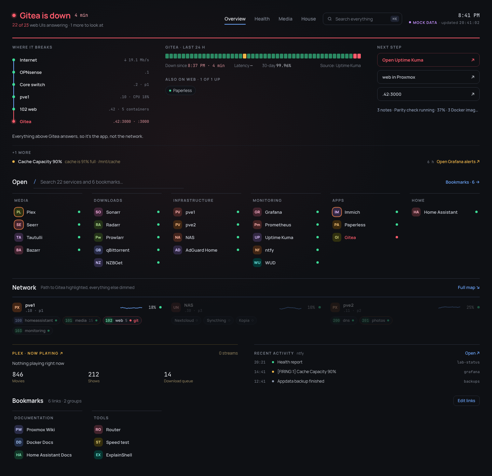
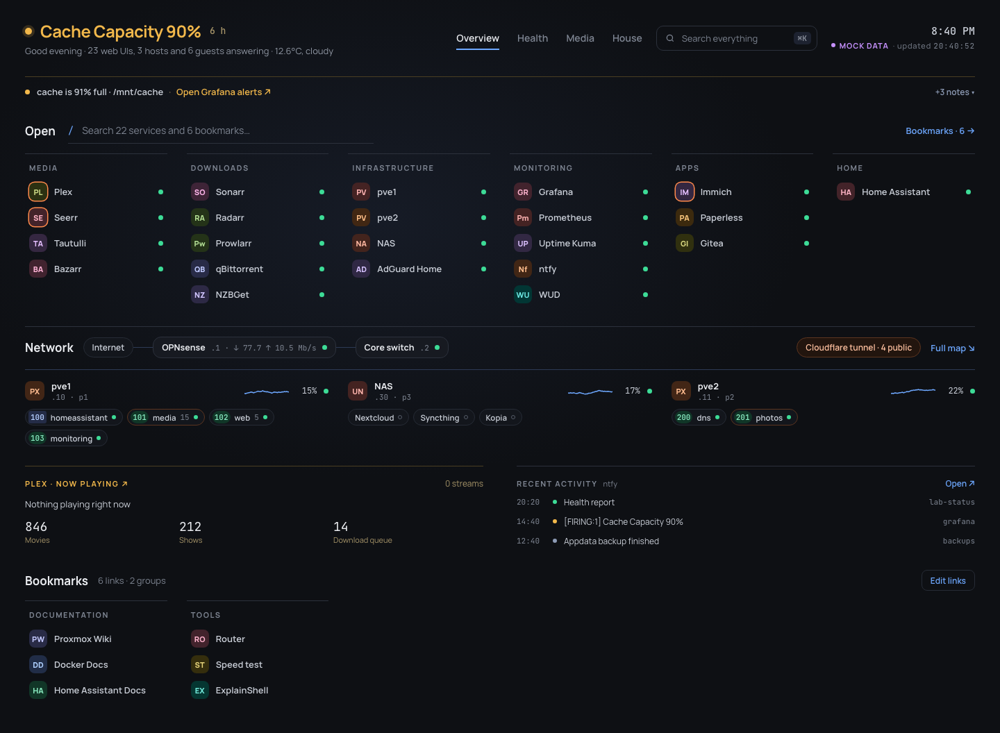
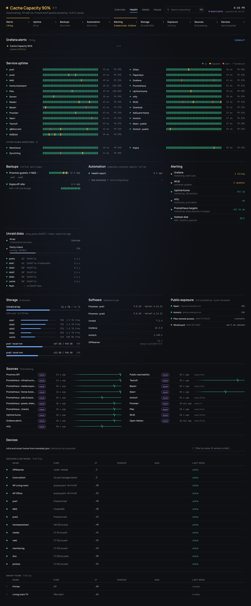
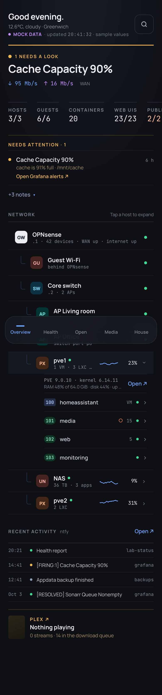

# Overlook

A status-first dashboard for a homelab. One page answers three questions: **is anything broken, where on the network did it break, and what do I do next?**



Overlook reads the tools you already run (Proxmox, Prometheus, Uptime Kuma, Grafana, ntfy, Home Assistant, the *arr stack, Plex) and turns them into one view:

- **A status line built from every signal.** Green when all is well. Amber when something needs a look, with the worst item named. Red when something is down; the Overview then becomes the incident.
- **Where it broke.** The network map, from the internet through your gateway and switch to the host, the guest and the web UI, with each hop's own status. "Everything above X answers, so it's the app, not the network."
- **Nothing stale shown as current.** Every source has a max age. When a source stops answering, its data drops out and the page says so, never a frozen number.
- **Read-only.** Every key is read-only and stays on the server. The page has no buttons that act on your lab. Home Assistant is shown, never controlled.
- **Only what you have.** Each integration is a module. A lab without Plex, Home Assistant or a UPS simply doesn't see those sections.

It runs as one small container (Node 22, Hono, React) and keeps its state in one data folder.

## Try it

```sh
git clone https://github.com/trialskid/overlook && cd overlook
npm ci
npm run demo          # the fictional Acme Lab on mock data: http://localhost:5173
```

## Run it for your lab

1. Copy `config/example.homelab.json` to `config/homelab.json` and describe your lab. Hosts, guests and web UIs are required. Everything else is optional; see [docs/CONFIG.md](docs/CONFIG.md).
2. Copy `.env.example` to `.env` (mode 600). Add the URL and a **read-only** key for each integration you have; see [docs/INTEGRATIONS.md](docs/INTEGRATIONS.md).
3. Start it:

```sh
docker compose up -d   # docker-compose.yml: the image, ./config mounted read-only, a data volume
```

Keep it on your LAN or behind a reverse proxy with a login. It has its own optional password login (`CC_LOGIN_BCRYPT`). See [docs/DEPLOY.md](docs/DEPLOY.md) and [SECURITY.md](SECURITY.md).

## What it reads

| Module | Source | Shows |
|---|---|---|
| `proxmox` | Proxmox API (PVEAuditor token) | hosts, guests, resources, storage, vzdump backups |
| `prometheus` | node_exporter, cAdvisor, scrape targets, your `jobs` | host resources, container counts, backup and automation jobs |
| `network` | snmp_exporter on your gateway and switch | the map's upstream chain, WAN link and rate, port and segment state |
| `kuma` | Uptime Kuma `/metrics` | every web UI's and app's status, 24 h strips, certificates |
| `grafana` | Grafana alerting API | firing alerts, folded into the items they explain |
| `ntfy` | ntfy | health and the recent-activity feed |
| `probes` | your public endpoints, from inside | public reachability |
| `plex` `sonarr` `radarr` `bazarr` `prowlarr` `seerr` `qbittorrent` `nzbget` `immich` `chaptarr` | their APIs, exportarr and exporters | the Media tab: now playing, the request → watch pipeline, library health |
| `homeassistant` | Home Assistant's Prometheus integration | the House tab: locks, garage, detectors, climate, appliances, lights |
| `ups` `unraid` `apt` | textfile collectors (in [contrib/collectors](contrib/collectors)) | power, array and disk health, pending updates |
| `edge` | cloudflared, Caddy and ntfy metrics | tunnels, proxy reloads, push delivery |
| `checks` | your own PromQL | a row and an item per check past its threshold |
| `spotlight` | your own readiness PromQL | one app you care most about, kept in view |
| `devices` | a JSON file your own job writes | the LAN's devices, online and offline |
| `weather` | Open-Meteo | the header's weather |

## Screens

| Calm | Health | Phone |
|---|---|---|
|  |  |  |

## Develop

```sh
npm run dev           # backend :8787 (reads .env and config/homelab.json) + Vite :5173
npm run demo          # the same on mock data and the example lab
npm test              # unit and end-to-end tests on the example lab
npm run typecheck
npm run build         # dist/web + dist/server/index.js
```

See [CONTRIBUTING.md](CONTRIBUTING.md) and [docs/ARCHITECTURE.md](docs/ARCHITECTURE.md).

## License

MIT. See [LICENSE](LICENSE).
